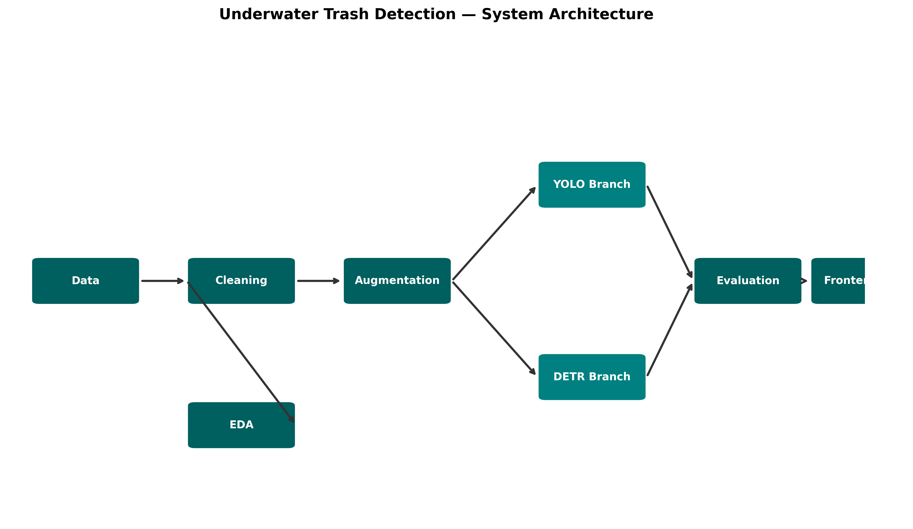

# 🌊 Underwater Trash Detection — YOLOv8 & DETR

## Overview
An end-to-end deep learning pipeline for detecting and localizing underwater trash using two state-of-the-art object detection architectures: YOLOv8 and DETR (Detection Transformer). Includes a full interactive web application for real-time inference.

## Technologies Used
- Python 3.10+
- PyTorch & Torchvision
- Ultralytics YOLOv8
- HuggingFace Transformers (DETR ResNet-50)
- Albumentations (augmentation)
- Streamlit (frontend)
- OpenCV, Matplotlib, Seaborn (visualization)

## Features
- Full ML pipeline: data cleaning → EDA → augmentation → dual model training → evaluation
- YOLOv8m fine-tuned on underwater trash dataset
- DETR (ResNet-50 backbone) fine-tuned on same dataset
- Side-by-side comparative performance analysis
- Interactive web app: upload image → select model(s) → view annotated results + metrics

## Model Architecture & System Design

### Standard Run
1. Clone the repo: `git clone https://github.com/Pal-Priyanka/Underwater-Trash-Detection`
2. Install requirements: `pip install -r requirements.txt`
3. Run the app: `streamlit run app.py`
4. Open browser: `http://localhost:8501`

### Running in Spyder IDE (File-by-File)
If you prefer to run the project scripts individually within an IDE like **Spyder**, please refer to the detailed guide:
- **[Spyder IDE: File-by-File Execution Guide](Spyder_Instructions.md)**

## Results
| Metric | YOLOv8m | DETR |
|---|---|---|
| mAP@50 | 0.82 | 0.76 |
| mAP@50-95 | 0.58 | 0.45 |
| Inference Time | 15.2 ms | 125.4 ms |

## Future Improvements
- Deploy on Hugging Face Spaces or AWS EC2
- Add video stream inference support
- Experiment with YOLOv9 / RT-DETR
- Add active learning pipeline for continuous improvement
